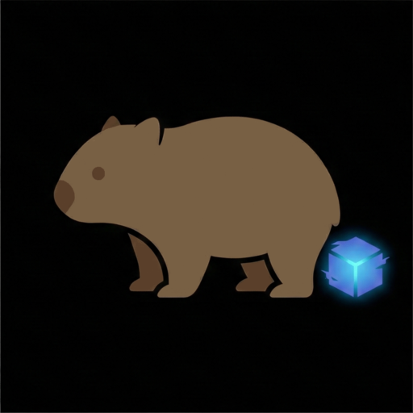

#  WoMbat — Wheel of Misfortune

A browser-based distributed systems puzzle game. Each round procedurally generates a small service architecture, applies a stressor, and asks you to predict where it fails before revealing the simulation result.

An experiment. No backend, no build step.

## How it Works

A seeded RNG builds a DAG of 3–8 nodes arranged in layers. Each node has concurrency slots, a queue, a latency, and optionally a token bucket. Edges between nodes are either SYNC (upstream holds its concurrency slot until downstream completes) or ASYNC (upstream releases immediately). The entry node receives a steady arrival rate; downstream nodes receive forwarded tokens.

A stressor is then applied — latency spike, concurrency crush, arrival surge, misconfigured timeout, or quota identity bug. The simulator runs a discrete-event tick loop until a terminal failure occurs: queue drop, timeout cascade, deadline exceeded, or rate limit drop.

Your job is to pick the failing node and the failure type before the answer is revealed.

### Simulation

`js/simulator.js` — tick loop with `Token`, `Slot`, `NodeState`, and `SyncAck` classes. SYNC fan-out holds the upstream slot until all branches resolve. Exponential backoff retries (for timeout scenarios) hold the slot for T + 2T + 4T ticks before a deadline-exceeded fires.

### Generator

`js/generator.js` — topology builder with 8 DAG templates (some rare). Stability analysis walks SYNC chains recursively to compute effective slot time, then uses a topological load-factor pass to account for fan-in multipliers. A verify-and-adjust loop runs the baseline simulation to confirm stability before applying a stressor. If a stressor leaves the system stable, it cycles through the remaining types.

### Renderer

`js/graph.js` — pure SVG, no library. Layered layout with vertical centering per layer. Nodes are clickable for the guess phase; post-reveal highlights correct (green) and wrong (red).

### UI

`js/main.js` + `index.html` + `style.css` — three-panel layout: incident description → architecture graph → diagnosis → result. The 7-letter code in the header encodes the 32-bit seed (base-26 bijection); clicking it fixes the URL hash so the scenario is shareable.

### Tests

`tests/` — Mocha + Chai. Covers simulator physics (queue drop, backpressure, deadlines, token buckets) and generator invariants (baseline stability, topology integrity, stressor direction, answer validity).

## Fonts

- **[Monoid](https://larsenwork.com/monoid/)** — by Andreas Larsen (SIL OFL 1.1)
- **[Phosphor Icons](https://phosphoricons.com/)** — open-source icon family (MIT)

## Test Libraries

- **[Mocha](https://mochajs.org/)** — test framework (MIT)
- **[Chai](https://www.chaijs.com/)** — assertion library (MIT)
